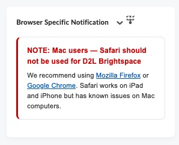
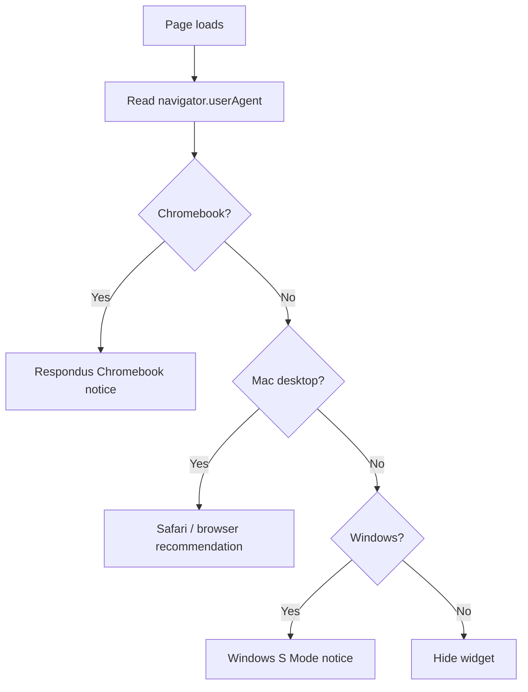

# Browser Specific Notification Widget

A custom **Brightspace (D2L) homepage HTML widget** that shows **device-specific notices** based on the user’s browser and operating system. No APIs, CSV files, or backend required—detection runs entirely in the browser using `navigator.userAgent`.

Originally built for **Delta College** to surface Safari, Chromebook/Respondus, and Windows S Mode guidance on the homepage.

---

## What it does

The widget detects the visitor’s device type and displays one targeted notice:

| Device | Message shown |
|--------|----------------|
| **Chromebook** | Respondus LockDown Browser pop-up instructions, restart reminder, and eLearning booking link |
| **Mac desktop** | Avoid Safari on Mac; use Firefox or Chrome instead (iPad/iPhone excluded) |
| **Windows** | Windows S Mode notice and link to switch out of S Mode for Respondus |
| **Other devices** | Widget hidden (no message) |

Only **one** message is shown per page load. Chromebook is checked first, then Mac desktop, then Windows.

---

## Screenshot



---

## How it works



### Detection logic

| Device | How it is detected |
|--------|-------------------|
| **Chromebook** | User agent contains `CrOS` or `Chromebook` |
| **Mac desktop** | User agent contains `Macintosh` or `Mac OS X`, and is **not** iPad or iPhone |
| **iPad** | `iPad` in user agent, or `MacIntel` platform with touch points (iPadOS desktop mode) |
| **Windows** | User agent contains `Windows` |

**Note:** Windows **S Mode cannot be detected** from the user agent alone. The Windows message is shown to all Windows users as a preventive notice (same approach as the original widget).

---

## Files in this folder

| File | Description |
|------|-------------|
| `browser-specific-notification-widget.html` | Combined widget markup + inline CSS + JavaScript |
| `README.md` | This documentation |

---

## Installation (Delta College)

1. Open **Admin Tools → Homepage Management** (or your homepage widget editor).
2. Create or edit an **HTML / Custom Widget**.
3. Paste the full contents of `browser-specific-notification-widget.html`.
4. Save and add the widget to student-facing (or all-user) homepage layouts.
5. Test from a Mac, Windows PC, and Chromebook if possible.

---

## Message content

### Chromebook (combined from both source widgets)

- Respondus article link for pop-up allowance
- Required pop-up URL: `https://respondus1.d2l-partners.brightspace.com`
- Restart Chromebook reminder
- eLearning booking link (Delta College)

### Mac desktop

- Red warning: do not use Safari for D2L on Mac
- Links to Firefox and Chrome
- Note that Safari is acceptable on iPad/iPhone

### Windows

- S Mode explanation for Respondus / non-Store apps
- Link to Microsoft’s “Switch out of S Mode” article

---

## Adapting for other institutions

Search `browser-specific-notification-widget.html` for the `SUPPORT_LINKS` object:

```javascript
var SUPPORT_LINKS = {
  firefox: "https://www.mozilla.org/en-US/firefox/new/",
  chrome: "https://www.google.com/chrome/",
  respondusChromebook: "https://support.respondus.com/hc/en-us/articles/4409604356123-...",
  windowsSMode: "https://support.microsoft.com/en-us/windows/switching-out-of-s-mode-...",
  elearningBooking: "https://outlook.office365.com/owa/calendar/YOUR-SUPPORT/bookings/"
};
```

Also update:

```javascript
var RESPONDUS_POPUP_URL = "https://respondus1.d2l-partners.brightspace.com";
```

### Customization options

| Change | Where |
|--------|--------|
| Support booking URL | `SUPPORT_LINKS.elearningBooking` |
| Respondus help article | `SUPPORT_LINKS.respondusChromebook` |
| Brand colors | `renderCard(..., accentColor)` and inline styles in message functions |
| Hide Windows message for non-S-Mode users | Not possible via user agent—remove `isWindows()` block or narrow with your own logic |
| Show message for all users | Add a fallback in `displayDeviceMessage()` instead of `hideCard()` |

### Styling

Messages render inside a card with:

- Rounded border and left accent bar (color varies by device type)
- Responsive max-width (`900px`)
- Hidden entirely when no matching device type

---

## Customization checklist

- [ ] Update `elearningBooking` URL for your support team
- [ ] Verify Respondus pop-up URL for your LockDown Browser integration
- [ ] Test on Mac desktop (not iPad)
- [ ] Test on Chromebook (user agent should include `CrOS`)
- [ ] Test on Windows
- [ ] Confirm widget is hidden on Android / other devices if desired
- [ ] Place on appropriate homepage (student vs. all users)

---

## Troubleshooting

| Symptom | Likely cause |
|---------|----------------|
| Chromebook message not showing | User agent may not include `CrOS`—test in Chrome OS browser DevTools |
| Mac warning on iPad | iPadOS reports as Mac; widget excludes iPad via touch-point check |
| Windows message on every PC | Expected—S Mode cannot be detected client-side |
| Widget always hidden | User agent does not match Chromebook, Mac desktop, or Windows |
| Links open in same tab | Widget uses `target="_blank"` with `rel="noopener noreferrer"` |

### Test user agents (DevTools)

In Chrome DevTools → Network conditions → User agent, try:

- Chromebook: includes `CrOS`
- Mac: `Mozilla/5.0 (Macintosh; Intel Mac OS X 10_15_7)...`
- Windows: `Mozilla/5.0 (Windows NT 10.0; Win64; x64)...`

---

## Security and privacy notes

- No personal data is collected or transmitted.
- Detection uses only the browser’s user agent string (client-side).
- External links open in a new tab to support and vendor documentation.

---

## Related widgets

Other widgets in the [API-Widgets](https://github.com/Brightspace-Dashboard-Data-Community/API-Widgets) repository:

- **D2L Welcome Message** — personalized greeting and student engagement nudge
- **Upcoming Courses** — upcoming-term enrollments from SIS CSV
- **Tech Tips** — faculty random tips from a Content topic

---

## License and contribution

Shared for use and adaptation by other Brightspace administrators. When forking:

- Replace support and booking URLs
- Adjust message wording for your institution
- Test on target devices before production deployment

---

## Credits

Developed by **Delta College** eLearning / D2L administration.

Combines the original browser-specific notification widget and the Chromebook-only Respondus notice into a single unified widget with improved Chromebook detection (`CrOS`).
