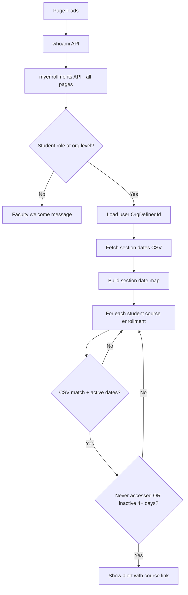

# D2L Welcome Message Widget

A custom **Brightspace (D2L) homepage HTML widget** that greets users by role and nudges students who have not recently accessed an active course.

Originally built for **Delta College**. The widget runs entirely in the browser using Brightspace’s built-in APIs and a CSV file you host in **Manage Files**—no separate server or OAuth app required.

---

## What it does

| Audience | Behavior |
|----------|----------|
| **Faculty / staff** | Shows a simple welcome: *"{First name}, welcome to D2L Brightspace at {Your College}!"* |
| **Students** | Shows a personalized welcome with **Org Defined ID** (student ID) and, when applicable, a **course engagement alert** |

### Student engagement alert

For each course where the student is enrolled as **Student**, the widget checks:

1. The course section exists in your **section dates CSV**
2. Today falls between that section’s **start** and **end** dates (course is “active”)
3. The student has **never** opened the course, **or** has not opened it in the last **4 days** (configurable)

If all conditions are met, a styled callout appears with a direct link to the course homepage, for example:

> You have not entered **PSY-235W-SU810-26/SP** in the last 4 days.

Only the **first** matching stale course is shown per page load.

---

## How it works



### Data sources

| Source | Purpose |
|--------|---------|
| `GET /d2l/api/lp/.../users/whoami` | Current user’s name and ID |
| `GET /d2l/api/lp/.../users/{id}` | Org Defined ID (student number) |
| `GET /d2l/api/lp/.../enrollments/myenrollments/` | All enrollments + per-course `LastAccessed` |
| **CSV in Manage Files** | Official section start/end dates from your SIS |

The widget uses the browser’s session (`credentials: "include"`) and the `X-CSRF-Token` from `localStorage`—the same pattern as other in-page Brightspace widgets.

### Course matching

Brightspace course **Code** values (e.g. `PSY-235W-SU810-26/SP`) are normalized and matched against keys built from your CSV:

- **Legacy format:** `SEC_NAME` → e.g. `PSY-235W-SU810`
- **New format:** `Depts` + `Course Number` + `Section` → e.g. `PSY` + `235W` + `SU810` → `PSY-235W-SU810`

Term suffixes like `-26/SP` are stripped from D2L codes before matching.

---

## Files in this folder

| File | Description |
|------|-------------|
| `welcome-message-widget.html` | Complete widget markup + inline CSS + JavaScript. Copy into a D2L **Custom Widget** or homepage HTML widget. |
| `README.md` | This documentation |

---

## Requirements

- Brightspace with permission to add **homepage widgets** (typically admin or role with widget management)
- **Manage Files** access to upload a CSV
- A recurring **SIS or scheduling export** with section identifiers and start/end dates
- Students must have **Org Defined ID** populated in Brightspace for the ID line to display

---

## Installation (Delta College)

1. Export or generate your section dates file for the current term.
2. Upload it to Manage Files:
   ```
   /content/api-apps/last-loggedin/course-sec-dates-26SP.csv
   ```
3. Open **Admin Tools → Homepage Management** (or your org’s widget editor).
4. Create or edit an **HTML / Custom Widget**.
5. Paste the full contents of `welcome-message-widget.html`.
6. Save and add the widget to the desired homepage layout.
7. Test as a student account in an active course.

---

## Adapting for other institutions

Other schools can reuse this widget with a few targeted edits. Search `welcome-message-widget.html` for the values below.

### 1. College name and branding

Update the default heading text and green accent color (`#005614`) in the HTML at the top of the file:

```html
<h2 id="welcome-msg-delta" style="... color: #005614; ...">
  Welcome to D2L Brightspace at Your College Name!
</h2>
```

Also update the faculty welcome string in JavaScript:

```javascript
welcomeEl.textContent = cleanFirstName + ", welcome to D2L Brightspace at Your College Name!";
```

Replace `#005614` in link styles (`courseLinkHtml`) if you use a different brand color.

### 2. Student org unit ID

Delta College uses org unit `6605` as the “student shell” enrollment to detect students:

```javascript
e.OrgUnit.Id === 6605
```

**Your school:** Find your top-level or “All Students” org unit ID (Admin Tools → Org Unit Editor) and replace `6605`.

Alternative: detect students by role name only across enrollments, or by `OrgDefinedId` pattern—adjust the `isStudent` check to match your org structure.

### 3. CSV URL

Change the fetch URL to your Manage Files path:

```javascript
const csvUrl = "https://YOUR-BRIGHTSPACE-DOMAIN/content/YOUR-FOLDER/course-sec-dates-TERM.csv";
```

Use a stable filename per term (e.g. `course-sec-dates-26FA.csv`) and update each semester.

### 4. Term filter

Update the regex to match your term codes:

```javascript
const SPRING_SUMMER_26_TERMS = /^26\/(SP|SU|SM|SS)$/i;
```

Examples:

| Semester | Example regex |
|----------|----------------|
| Fall 2026 | `/^26\/FA$/i` |
| Winter 2026 | `/^26\/WI$/i` |
| Full year | `/^26\//i` (broader; may include off-term sections) |

### 5. Inactivity threshold

Default is **4 days** (`5760` minutes):

```javascript
const inactivityMinutes = 5760; // 4 days
```

| Days | Minutes |
|------|---------|
| 3 | 4320 |
| 4 | 5760 |
| 5 | 7200 |
| 7 | 10080 |

### 6. Blocked users (optional)

Admin test accounts can be excluded from the widget:

```javascript
const blockedUsers = ['admin.username', 'another.user'];
```

This pattern is not in the current welcome widget but can be copied from the Upcoming Courses widget if needed.

---

## CSV format

The widget supports **two** column layouts.

### Legacy SIS export

| Column | Example |
|--------|---------|
| `SEC_NAME` | `ENG-111-SP810` |
| `SEC_START_DATE` | `05/11/2026` |
| `SEC_END_DATE` | `06/26/2026` |
| `SEC_TERM` (optional) | `26/SP` |

### New course section meetings export

| Column | Example |
|--------|---------|
| `Depts` | `PSY` |
| `Course Number` | `235W` |
| `Section` | `SU810` |
| `Start Date` | `05/11/2026` |
| `End Date` | `08/20/2026` |
| `Term` | `26/SP` |
| `Status` | `A` (rows with `C` / cancelled are skipped) |

Dates should be `MM/DD/YYYY` or `M/D/YY`. UTF-8 BOM at the start of the file is handled.

**Important:** Section keys in the CSV must align with how Brightspace stores course **Code** values (usually `DEPT-NUMBER-SECTION`, sometimes without the `-26/SP` suffix).

---

## Customization checklist

Use this when rolling out to a new term or institution:

- [ ] Upload current-term CSV to Manage Files
- [ ] Update `csvUrl` in the widget
- [ ] Update term filter regex
- [ ] Confirm student org unit ID (`6605` or your equivalent)
- [ ] Set `inactivityMinutes` (days × 24 × 60)
- [ ] Update college name and brand color
- [ ] Test with: never-accessed student, recently active student, faculty account
- [ ] Check browser console for `Welcome widget section date keys loaded: N`

---

## Troubleshooting

| Symptom | Likely cause |
|---------|----------------|
| No alert for a student who never entered the course | CSV section key doesn’t match D2L course Code; or course dates aren’t “active” today; or wrong term CSV |
| `CSV fetch failed: 404` | File missing or wrong path in Manage Files |
| Welcome shows but no student ID | `OrgDefinedId` empty on user profile |
| Faculty see student messaging | Wrong student org unit ID in `isStudent` check |
| Alert never clears after visiting course | Brightspace `LastAccessed` may take time to update; student may need a full course visit, not just homepage |
| Widget runs twice | Duplicate widget instances on homepage; script uses `window.deltaWelcomeWidgetLoaded` guard |

### Debug logging

Open **Developer Tools → Console** while logged in as the test user. Look for:

```
Welcome widget starting...
Welcome widget section date keys loaded: 1234
Inactive matched courses: [...]
```

An empty `Inactive matched courses` array with a healthy section key count usually means matching or date-window logic is filtering the course out.

---

## Security and privacy notes

- The widget only accesses the **currently logged-in user’s** enrollments via `myenrollments`.
- The CSV should contain **section metadata only**, not student PII.
- Host the CSV on your Brightspace domain so `fetch` uses the user’s existing session.
- Do not embed API keys or secrets in the widget HTML.

---

## Semester maintenance

At the start of each term:

1. Generate a new section dates CSV from your SIS or reporting tool.
2. Upload to Manage Files (keep or rotate filename).
3. Update `csvUrl` and term filter if the term code changed.
4. Spot-check a few known section codes against D2L course codes.

---

## Related widgets

Other custom widgets in this repository live under `D2L Widgets/`, including:

- **Upcoming Courses** — shows Spring/Summer or Fall enrollments from an Insights enrollment CSV

---

## License and contribution

This widget is shared for use and adaptation by other Brightspace administrators. When forking or publishing to GitHub:

- Replace institution-specific URLs, org unit IDs, and branding
- Document your CSV source and update schedule in your fork’s README
- Test in a sandbox org before deploying to production

---

## Credits

Developed by **Delta College** eLearning / D2L administration for student engagement on the Brightspace homepage.

**Version notes (Spring/Summer 2026):**

- 4-day inactivity threshold
- CSV: `course-sec-dates-26SP.csv`
- Supports legacy `SEC_*` columns and new `course_sec_meetings` export format
