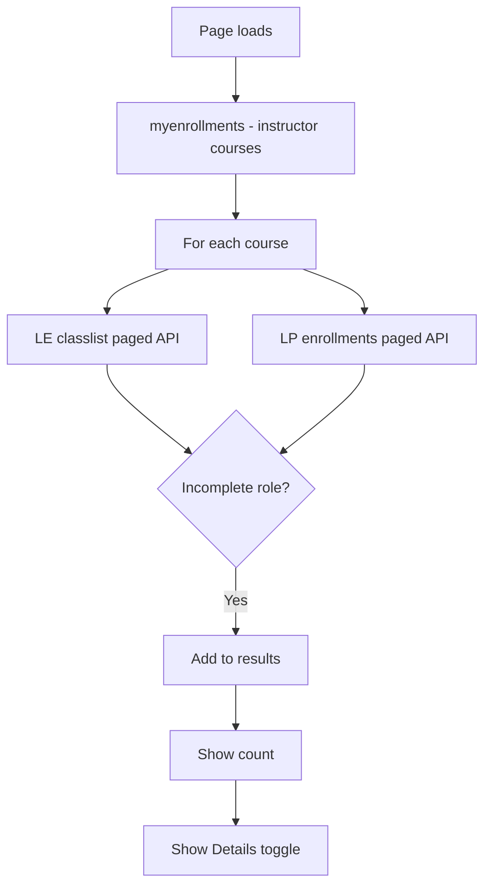

# Faculty Incomplete Students Widget

A custom **Brightspace (D2L) homepage HTML widget** that shows faculty how many students in their courses are enrolled with an **Incomplete** role, with an optional detail list of names and course links.

Originally built for **Delta College**. Intended for **faculty-only** homepages. Runs entirely in the browser using Brightspace LP and LE APIs.

---

## What it does

1. Loads all courses where the logged-in user is an **Instructor**
2. Scans each course for students with an Incomplete enrollment role
3. Displays a count: *"N student(s) currently marked as Incomplete."*
4. **Show Details** reveals a list with:
   - Student name (blurred until clicked for privacy on shared screens)
   - Link to the course homepage

Students are deduplicated per course + name. Both **active classlist** and **LP enrollment** (including inactive) records are checked so incomplete students are not missed.

---

## How it works



### Data sources

| API | Purpose |
|-----|---------|
| `GET /d2l/api/lp/.../enrollments/myenrollments/` | Instructor course list |
| `GET /d2l/api/le/.../{orgUnitId}/classlist/paged/` | Active enrollments + roles |
| `GET /d2l/api/lp/.../enrollments/orgUnits/{orgUnitId}/users/` | All enrollments including inactive |

### Incomplete role detection

A student matches if any of the following are true:

| Check | Default value |
|-------|----------------|
| Role ID | `107` (`INCOMPLETE_ROLE_ID`) |
| Role name contains | `"incomplete"` (case-insensitive) |
| Role name equals | `"student2"` (case-insensitive) |

---

## Files in this folder

| File | Description |
|------|-------------|
| `faculty-incomplete-students-widget.html` | Complete widget markup + inline CSS + JavaScript |
| `README.md` | This documentation |

---

## Requirements

- Faculty-only homepage placement
- Logged-in user must be enrolled as **Instructor** (role name or ID `102`) in courses to scan
- User must have permission to view classlist and enrollments for their courses
- Your institution must use an Incomplete role matching the config above (or customize IDs/names)

---

## Installation

1. Confirm your Incomplete role ID and name in **Admin Tools → Roles and Permissions**.
2. Open **Admin Tools → Homepage Management** on the **faculty homepage**.
3. Create or edit an **HTML / Custom Widget**.
4. Paste the full contents of `faculty-incomplete-students-widget.html`.
5. Update `INCOMPLETE_ROLE_ID`, `INSTRUCTOR_ROLE_ID`, and API versions if needed.
6. Save and test as an instructor with known incomplete students.

---

## Adapting for other institutions

Search `faculty-incomplete-students-widget.html` for the config block:

```javascript
var LP_VERSION = "1.51";
var LE_VERSION = "1.78";

var INCOMPLETE_ROLE_ID = 107;
var INCOMPLETE_NAME_FRAGMENT = "incomplete";
var ALT_STUDENT_ROLE_EQ = "student2";
var INSTRUCTOR_ROLE_ID = 102;
```

| Setting | What to change |
|---------|----------------|
| `INCOMPLETE_ROLE_ID` | Your Incomplete org role ID |
| `INCOMPLETE_NAME_FRAGMENT` | Substring match on role display name |
| `ALT_STUDENT_ROLE_EQ` | Alternate role name (remove or change if unused) |
| `INSTRUCTOR_ROLE_ID` | Instructor role ID used to find courses to scan |
| `LP_VERSION` / `LE_VERSION` | API versions supported by your Brightspace instance |

### Branding

- Button color: `#005a9e`
- Link color: `#005a9e`
- Container background: `#f9f9f9`

### Privacy

Names are blurred (`filter: blur(6px)`) until the instructor clicks a name. Adjust or remove blur in the `populateWidget` HTML template if your policy differs.

---

## Customization checklist

- [ ] Confirm Incomplete role ID and name at your institution
- [ ] Confirm Instructor role ID (`102` or your equivalent)
- [ ] Place on faculty-only homepage
- [ ] Test with a course that has incomplete students
- [ ] Test with instructor who has no incomplete students (count = 0)
- [ ] Verify API versions work on your instance

---

## Troubleshooting

| Symptom | Likely cause |
|---------|----------------|
| Count always `0` | Wrong `INCOMPLETE_ROLE_ID` or role name; no incomplete enrollments |
| `Error loading data` | API permission denied; check console for 403/404 |
| Slow load | Many courses — widget scans all instructor courses sequentially |
| Names not blurred after click | Expected — click toggles blur off for that row |
| Duplicate students | Deduped by course + first + last name; same name in two courses shows twice |

### Debug

Open **Developer Tools → Console** for fetch errors. Failed classlist calls fall back to non-paged classlist; LP enrollment failures are logged per course.

---

## Security and privacy notes

- Only scans courses where the logged-in user is an instructor.
- Student names are blurred by default; clicking reveals on screen.
- No data is sent to external servers.
- Ensure widget is on a faculty-restricted homepage.

---

## Related widgets

Other widgets in the [API-Widgets](https://github.com/Brightspace-Dashboard-Data-Community/API-Widgets) repository:

- **Faculty Navigation Menu** — accordion with training, grades, sandbox tools
- **Tech Tips** — random faculty tips from a Content topic

---

## License and contribution

Shared for use and adaptation by other Brightspace administrators. When forking:

- Verify Incomplete and Instructor role IDs for your org
- Test with real incomplete enrollments before production

---

## Credits

Developed by **Delta College** eLearning / D2L administration.

**Version notes:**

- Incomplete role ID: `107`
- Instructor role ID: `102`
- LP API: `1.51`, LE API: `1.78`
