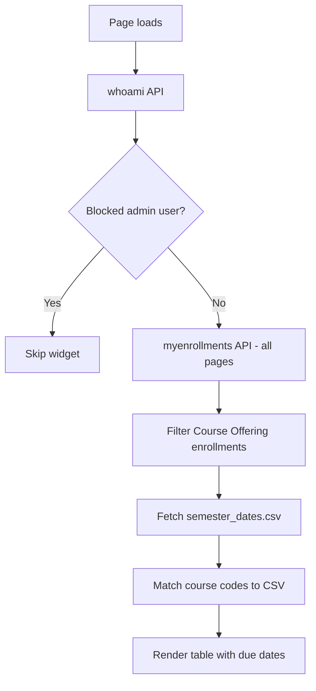

# Faculty Navigation Menu Widget

A custom **Brightspace (D2L) homepage HTML widget** that gives faculty a collapsible accordion menu with training links, institutional resources, grade due-date reminders, and sandbox course creation.

Originally built for **Delta College**. Intended for **faculty-only** homepages—place the widget on a homepage restricted to instructor roles.

---

## What it does

The widget renders a styled accordion (`<details>` / `<summary>`) with these sections:

| Section | Type | Description |
|---------|------|-------------|
| **Faculty Training** | Static links | eLearning Office YouTube video series |
| **D2L Webinars** | Static links | Bright Ideas for Higher Education webinar recordings |
| **Course Merge Request** | Static links | Spring/Summer and Fall merge request forms |
| **Help Desk** | Static links | Zoho desk, email, phone |
| **Student Support System** | Static link | Faculty SSS referral page |
| **Attendance Tracking** | Static link | Faculty Self-Service attendance |
| **Last Date of Attendance Info** | Static links | Semester dates PDF, instructor drop form |
| **Submit Grades By:** | **Dynamic** | Lists instructor courses with midterm/final due dates from CSV |
| **Add a ZZStudent** | Static link | Demo student enrollment web app |
| **Create Sandbox Course** | **Dynamic** | Form to create sandbox course + ZZDemo student via D2L API |

---

## How it works

### Static sections

Most accordion panels are HTML content you edit directly in the widget—links, text, and policies for your institution.

### Submit Grades By (dynamic)



| Source | Purpose |
|--------|---------|
| `GET /d2l/api/lp/.../enrollments/myenrollments/` | Instructor's course offerings |
| **CSV:** `semester_dates.csv` | Mid-term and final grade due dates per course code |

**CSV required headers:**

- `Course`
- `Mid-Term Grades Due`
- `Final Grades Due`

Course codes are normalized (uppercase, `-COURSE` suffix stripped) for matching.

### Create Sandbox Course (dynamic)

Uses Brightspace LP APIs to:

1. Get current user (`whoami`)
2. **POST** create course under sandbox semester/template
3. Enroll instructor (RoleId `102`)
4. Create or reuse `ZZDemoStudent-{courseId}` user
5. Enroll demo student (RoleId `112`)

Requires the logged-in user to have permissions to create courses and users.

---

## Files in this folder

| File | Description |
|------|-------------|
| `faculty-navigation-menu-widget.html` | Complete accordion widget with inline CSS and JavaScript |
| `README.md` | This documentation |

---

## Requirements

- Faculty-only homepage placement (role restriction in Brightspace)
- **Manage Files** CSV for grade due dates: `semester_dates.csv`
- For sandbox creation: course template ID, semester ID, and API permissions
- ZZStudent web app hosted separately (linked, not embedded)

---

## Installation (Delta College)

1. Upload or maintain grade due dates CSV:
   ```
   /content/api-apps/important-dates/semester_dates.csv
   ```
2. Verify sandbox settings in the widget (`CourseTemplateId`, `SemesterId`, role IDs).
3. Open **Admin Tools → Homepage Management**.
4. Create or edit an **HTML / Custom Widget** on the **faculty homepage**.
5. Paste the full contents of `faculty-navigation-menu-widget.html`.
6. Save and test as an instructor.

---

## Adapting for other institutions

### Static content sections

Edit the HTML inside each `<details>` block:

- Training and webinar URLs
- Merge request forms
- Help desk and support links
- Policy text and phone numbers

### Brand color

Accordion headers use Delta green `#005b4d`. Search and replace across the file for your brand color.

### Grade due dates CSV

```javascript
const csvResponse = await fetch('https://YOUR-DOMAIN/content/YOUR-FOLDER/semester_dates.csv');
```

Update course link base URL — the widget uses a relative path `/d2l/home/{id}` by default.

```javascript
<a href="https://YOUR-DOMAIN/d2l/home/${course.id}" ...
```

### Blocked users

```javascript
const blockedUsers = ['admin.username', 'another.user'];
```

Admin test accounts are skipped for the grade-due-date section.

### Sandbox course creation

Update these institution-specific values in `createSandboxCourse()`:

| Setting | Delta College value | Description |
|---------|---------------------|-------------|
| `CourseTemplateId` | `2966247` | Sandbox course template org unit ID |
| `SemesterId` | `2993337` | Sandbox semester org unit ID |
| Instructor `RoleId` | `102` | Role enrolled on new course |
| Student `RoleId` | `112` | ZZDemo student role |
| `ExternalEmail` | `sandbox@yourcollege.edu` | Demo student email domain |

**Find IDs:** Admin Tools → Org Unit Editor, or API exploration in your sandbox.

### ZZStudent link

```html
<a href="https://YOUR-DOMAIN/content/api-apps/add-zzstudent-webapp/Add-ZZ-Student.html">
```

Replace with your institution's demo-student enrollment tool if you have one.

---

## Customization checklist

- [ ] Replace static links and text in each accordion section
- [ ] Upload `semester_dates.csv` with correct headers
- [ ] Update CSV fetch URL
- [ ] Set `CourseTemplateId` and `SemesterId` for sandbox creation
- [ ] Confirm instructor and student role IDs
- [ ] Restrict widget to faculty homepage
- [ ] Test grade due-date list as instructor
- [ ] Test sandbox creation in sandbox/staging first
- [ ] Update merge form links each semester

---

## Troubleshooting

| Symptom | Likely cause |
|---------|----------------|
| Grade table empty | Course codes in CSV don't match D2L codes; or CSV 404 |
| `CSV file is missing required headers` | Column names must match exactly (case-insensitive) |
| Sandbox creation fails | Wrong template/semester ID; user lacks create-course permission |
| ZZStudent warning but course created | User creation/enrollment permission issue |
| Widget skipped entirely (grades) | Username in `blockedUsers` list |
| Accordion won't open | Browser doesn't support `<details>` (rare; all modern browsers support it) |

### Debug tips

Open DevTools → Console when testing **Submit Grades By**. Errors display in the red `#error-message` element and the console.

For sandbox creation, check Network tab for failed POST to `/courses/` or `/enrollments/`.

---

## Security and privacy notes

- **Sandbox creation** grants real API write access—only expose to trusted faculty on a restricted homepage.
- Demo students are created with predictable usernames (`ZZDemoStudent-{courseId}`).
- Grade due-date section only shows courses the logged-in user is enrolled in as instructor.
- Review role permissions before enabling sandbox creation in production.

---

## Semester maintenance

Each term, update:

- Course merge request form links (Spring/Summer, Fall)
- `semester_dates.csv` with current course codes and due dates
- Webinar/training content as new sessions are recorded
- Last Date of Attendance links if semester dates PDF changes

---

## Related widgets

Other widgets in the [API-Widgets](https://github.com/Brightspace-Dashboard-Data-Community/API-Widgets) repository:

- **Tech Tips** — random faculty tips from a Content topic
- **D2L Welcome Message** — student welcome and engagement nudge
- **Upcoming Courses** — upcoming-term enrollments from SIS CSV

---

## License and contribution

Shared for use and adaptation by other Brightspace administrators. When forking:

- Replace all Delta-specific URLs, IDs, and policies
- Test sandbox creation in a non-production environment first
- Document your CSV format and update schedule

---

## Credits

Developed by **Delta College** eLearning / D2L administration.

**Version notes:**

- Accordion brand color: `#005b4d`
- Grade CSV: `semester_dates.csv`
- Sandbox template: `2966247`, semester: `2993337`
- Fixed broken training video URL (`i2P50JK-law`) in community release
