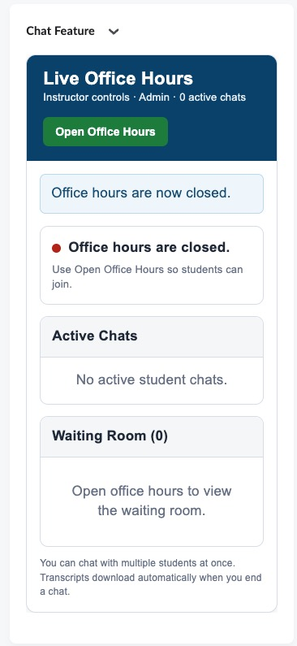
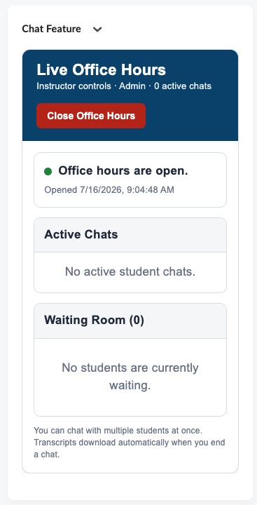

# Office Hours Chat Widget

A custom **Brightspace (D2L) course homepage Custom Widget** that runs **live office hours chat** between an instructor and students: open/close hours, a waiting room, private chats (including multiple concurrent chats), and downloadable transcripts.

Originally built for **Delta College**. Must be pasted into a **Custom Widget** on a **course homepage** (not a Content topic), because it depends on Brightspace replace strings and the **Custom Widget Data API**.

---

## What it does

### Instructor view

1. **Open / Close Office Hours** — shared course-level flag all students can see
2. **Waiting room** — lists students who joined while hours are open
3. **Start Chat** — admits a waiting student into a private conversation
4. **Multiple concurrent chats** — chat with more than one student at once (optional cap via config)
5. **Send messages**, **End Chat**, and **Download Log** (TXT transcript)
6. Closing office hours can end active chats and auto-download transcripts

### Student view

1. Sees whether office hours are **open** or **closed**
2. **Join Waiting Room** when open
3. When admitted → private chat with the instructor
4. **Download My Log** after or during a session
5. Can leave the waiting room or join again after a chat ends

---

## Screenshots

Two instructor-view screenshots show the office-hours open/closed states.

| Screenshot | What it shows |
|------------|----------------|
| **Closed** — `office-hours-chat-closed.jpg` | Office hours are closed. Green **Open Office Hours** button; waiting room is hidden until hours open. |
| **Open** — `office-hour-chat-open.jpg` | Office hours are open. Red **Close Office Hours** button; Active Chats and Waiting Room panels are ready for students. |





---

## How it works

```mermaid
flowchart TD
    A[Course homepage Custom Widget loads] --> B[Replace {OrgUnitId} {widgetid} {RoleName}]
    B --> C[whoami + role detect]
    C --> D{Instructor?}
    D -->|Yes| E[Read shared widget data]
    E --> F[Open/close hours + waiting room + chats]
    D -->|No| G[Read shared + mydata]
    G --> H[Join wait / chat / download]
    F --> I[Poll every 5s]
    H --> I
```

### Storage model (Custom Widget Data API)

| Store | Path | Purpose |
|-------|------|---------|
| **Shared** | `/widgetdata/{widgetId}` | `officeOpen`, `sessionId`, `activeChats` map (instructor messages live here) |
| **My data** | `/widgetdata/{widgetId}/mydata` | Student waiting/active status + student messages |
| **Per user** | `/widgetdata/{widgetId}/{userId}` | Instructor reads each waiting/active student’s data |

Schema **v3** uses `activeChats: { [studentId]: chat }` for multi-chat. Older single-chat fields (`activeStudentId`, `activeChat`) are migrated when present.

### Other APIs

| API | Purpose |
|-----|---------|
| `GET /d2l/api/lp/.../users/whoami` | Current user |
| `GET /d2l/api/lp/.../enrollments/orgUnits/{ou}/users/{userId}` | Course role detection |
| `GET /d2l/api/le/.../{ou}/classlist/` | Waiting-room student list |
| `GET/PUT` Custom Widget Data | Shared and per-user chat state |

All requests use session cookies and `X-CSRF-TOKEN`.

---

## Brightspace replace strings (required)

| Token | Replaced with |
|-------|----------------|
| `{OrgUnitId}` | Current course org unit ID |
| `{widgetid}` | Custom widget instance ID |
| `{RoleName}` | Viewer’s role name in the course (respects impersonation) |

These **only** work in a **Custom Widget**. Content topics will not replace them, and the Widget Data API will not be available.

---

## Files in this folder

| File | Description |
|------|-------------|
| `office-hours-chat-widget.html` | Complete widget markup + CSS + JavaScript |
| `office-hours-chat-closed.jpg` | Screenshot — instructor view, office hours closed |
| `office-hour-chat-open.jpg` | Screenshot — instructor view, office hours open |
| `README.md` | This documentation |

---

## Requirements

- **Custom Widget** on a **course** homepage (faculty and students both need the widget on that homepage)
- Permission to use **Custom Widget Data** (shared + my data) for enrolled users
- Instructor can read **classlist** and other users’ widget data for waiting-room scanning
- Role IDs configured to match your institution (see below)

---

## Installation

1. Confirm student and instructor **role IDs** in **Admin Tools → Roles and Permissions**.
2. Open **Homepage Management** for the **course** homepage template (or a specific course).
3. Create a **Custom Widget** (not HTML in Content).
4. Paste the full contents of `office-hours-chat-widget.html`.
5. Ensure `{OrgUnitId}`, `{widgetid}`, and `{RoleName}` remain as replace strings (do not hardcode unless testing).
6. Update `STUDENT_ROLE_IDS` / `INSTRUCTOR_ROLE_IDS` if your org differs from the defaults.
7. Save and test as instructor and as student (impersonation is supported for role detect).

---

## Adapting for other institutions

Search `office-hours-chat-widget.html` for the `CONFIG` block:

```javascript
const CONFIG = Object.freeze({
  COURSE_ID: parseInt("{OrgUnitId}", 10) || 0,
  LP_VERSION: "1.51",
  LE_VERSION: "1.82",
  INSTRUCTOR_USER_IDS: [ /* optional hard overrides */ ],
  STUDENT_ROLE_IDS: [101, 107, 112],
  INSTRUCTOR_ROLE_IDS: [102],
  CUSTOM_WIDGET_ID: "{widgetid}",
  ROLE_NAME: "{RoleName}",
  POLL_INTERVAL_MS: 5000,
  QUEUE_REFRESH_MS: 10000,
  WAITING_EXPIRATION_MINUTES: 120,
  MAX_MESSAGE_LENGTH: 1500,
  MAX_MESSAGES_PER_SESSION: 100,
  MAX_CONCURRENT_CHATS: 0,  // 0 = unlimited
  AUTO_DOWNLOAD_ON_END: true,
  WIDGET_TITLE: "Live Office Hours"
});
```

| Setting | What to change |
|---------|----------------|
| `STUDENT_ROLE_IDS` | Student, Incomplete, Student View / demo roles at your org |
| `INSTRUCTOR_ROLE_IDS` | Instructor (and any faculty roles that should host office hours) |
| `INSTRUCTOR_USER_IDS` | Optional hard-coded instructor user IDs if auto-detect fails |
| `MAX_CONCURRENT_CHATS` | Cap simultaneous student chats (`0` = unlimited) |
| `WAITING_EXPIRATION_MINUTES` | Drop stale waiting-room entries |
| `AUTO_DOWNLOAD_ON_END` | Auto-download TXT transcript when a chat ends |
| `WIDGET_TITLE` | Header title shown in the UI |
| `LP_VERSION` / `LE_VERSION` | API versions for your Brightspace instance |

### Default role IDs (Delta College)

| Role | ID |
|------|-----|
| Student | `101` |
| Instructor | `102` |
| Incomplete Student | `107` |
| Student View / ZZDemo | `112` |

### Branding

- Header background: `#00416B`
- Open status: green; closed: red
- Primary buttons: `#1264a3`

---

## Customization checklist

- [ ] Paste into a **Custom Widget** on a course homepage
- [ ] Confirm `{OrgUnitId}`, `{widgetid}`, `{RoleName}` are replaced at runtime
- [ ] Set `STUDENT_ROLE_IDS` / `INSTRUCTOR_ROLE_IDS` for your org
- [ ] Test instructor: open hours → see waiting room → start chat → send → end → transcript
- [ ] Test student: join wait → admit → chat → download log
- [ ] Test impersonation (admin as student) if you use that workflow
- [ ] Confirm Custom Widget Data permissions for students and instructors

---

## Troubleshooting

| Symptom | Likely cause |
|---------|----------------|
| “Could not detect the course ID” | Not on a course homepage, or `{OrgUnitId}` not replaced |
| “Could not detect the widget ID” | Pasted into Content instead of a Custom Widget; `{widgetid}` not replaced |
| Student sees instructor UI (or reverse) | Role IDs / `{RoleName}` mismatch — adjust CONFIG or enrollment role |
| Waiting room always empty | Classlist permission, wrong `STUDENT_ROLE_IDS`, or students not joining |
| Messages not syncing | Widget Data permission denied; check console for 403 |
| Poll works but queue stale | Waiting-room scan is every `QUEUE_REFRESH_MS` (default 10s) |

### Debug

Open **Developer Tools → Console**. Fatal errors render inside the widget shell with setup hints.

---

## Security and privacy notes

- Chat content is stored in **Brightspace Custom Widget Data** for the course widget instance.
- Instructors can read waiting/active student widget data for enrolled classlist users.
- Transcripts download as plain text to the instructor’s (or student’s) browser.
- Place on course homepages only; do not expose on org-level public pages.
- Waiting entries older than `WAITING_EXPIRATION_MINUTES` are ignored.

---

## Related widgets

- **ZZStudent Demo** — enroll a demo student so instructors can preview the student chat experience via impersonation

---

## License and contribution

Shared for use and adaptation by other Brightspace administrators. When forking:

- Update role IDs for your org
- Confirm Custom Widget Data is enabled and permitted
- Test both instructor and student flows before production

---

## Credits

Developed by **Delta College** eLearning / D2L administration.

**Version notes:**

- Widget Data schema: **v3** (multi-chat `activeChats`)
- Student role IDs: `101`, `107`, `112`
- Instructor role ID: `102`
- LP API: `1.51`, LE API: `1.82`
