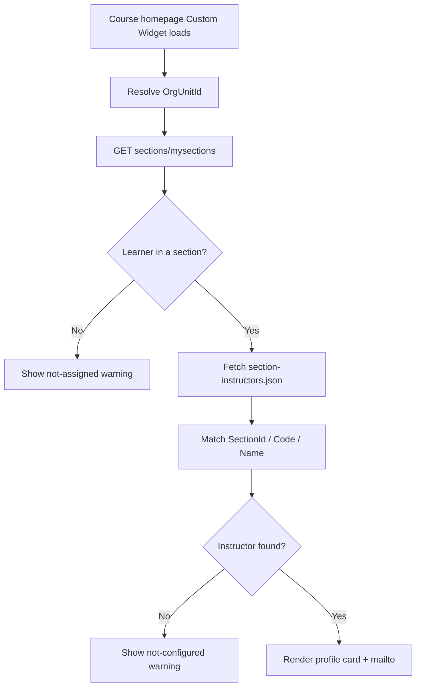

# Section Profile Widget

A custom **Brightspace (D2L) course homepage widget** that shows each student the instructor profile for **their enrolled section**. Designed for multi-section courses where different instructors teach different sections of the same offering.

Originally built for **Delta College**. Runs entirely in the browser using the Brightspace LP API and a JSON config file you host in **Manage Files**—no separate server or OAuth application required.

---

## What it does

1. Detects the current **course Org Unit ID** (`{OrgUnitId}` replace string, with URL fallback)
2. Calls `GET /d2l/api/lp/.../{orgUnitId}/sections/mysections/` for the logged-in learner
3. Loads `section-instructors.json` from Manage Files for that course
4. Maps the learner’s section (by **Section ID**, **Code**, or **Name**) to an instructor profile
5. Renders a profile card: photo, name, title, office hours, office, phone, bio, and **Email Instructor**

If the learner is not in a section, or no instructor is mapped, the widget shows a clear warning instead of a blank card.

---

## Screenshot


---

## How it works



### Why `mysections`?

The widget uses **`/sections/mysections/`**, which returns only the current user’s section membership. It does **not** request the full section enrollment roster, so typical student roles can use it without elevated classlist permissions.

### Data sources

| Source | Purpose |
|--------|---------|
| `GET /d2l/api/lp/{LP_VERSION}/{orgUnitId}/sections/mysections/` | Learner’s section(s) in the current course |
| **JSON in Manage Files** | Instructor profiles + section → instructor map |
| Profile images in Manage Files (or absolute URLs) | Photo on the card |

All requests use the browser session (`credentials: "include"`). API paths are **relative** (no hardcoded Brightspace domain).

---

## Files in this folder

| File | Description |
|------|-------------|
| `section-profile-widget.html` | **Prefer this** — paste into a Brightspace Custom Widget |
| `section-instructors.json` | Sample config — replace IDs, names, and contact details |
| `sample-instructor-a.jpg` / `sample-instructor-b.jpg` | Optional sample photos for local testing |
| `embed-snippet.html` | Optional iframe embed if you host the HTML file in Manage Files |
| `section-profile-widget.png` | Screenshot |
| `README.md` | This documentation |

---

## Requirements

- **Course homepage** Custom Widget (so `{OrgUnitId}` is replaced and the learner is in a course context)
- Course uses **Sections** and learners are assigned to sections
- Permission for learners to call **`sections/mysections`** (standard for Student in most orgs)
- Ability to upload JSON (and optional images) to **Manage Files** for each course, or a shared multi-course JSON (advanced)

---

## Installation

You can share the **widget HTML once** at the organization (homepage template / shared custom widget) while keeping **per-course JSON**, or configure everything inside a single course. Both approaches use the same HTML file.

### Option A — Course-level (single course)

Best for a pilot or one multi-section offering.

1. In the course, open **Course Admin → Manage Files**.
2. Upload to the **root** of the course files:
   - `section-instructors.json`
   - Instructor images referenced by the JSON (e.g. `sample-instructor-a.jpg`)
3. Edit `section-instructors.json`:
   - Replace sample instructor details with real profiles
   - Map each section ID (recommended) — see [Finding section IDs](#finding-section-ids)
4. Open **Course Admin → Homepages** (or edit the course homepage).
5. Create a **Custom Widget**, open the HTML source editor, and paste the full contents of `section-profile-widget.html`.
6. Confirm `CONFIG.CONFIG_URL` still contains `{OrgUnitId}` (do not hardcode unless testing).
7. Save, place the widget on the homepage (sidebar works well), and test by impersonating learners in different sections.

### Option B — Org-level widget, per-course config (recommended for scale)

Share one Custom Widget across many courses; each course still owns its instructor JSON.

1. Create a **Custom Widget** once under **Admin Tools → Homepage Management** (or your org’s shared widgets / course homepage template).
2. Paste `section-profile-widget.html` into that shared widget.
3. Add the widget to the **course homepage template(s)** used by multi-section courses.
4. For **each course** that should show section-specific instructors:
   - Upload `section-instructors.json` (+ images) to that course’s **Manage Files** root
   - Set the `sections` map for that course’s Section IDs
5. Leave `CONFIG_URL` as:

   ```text
   /content/enforced/{OrgUnitId}/section-instructors.json
   ```

   Brightspace replaces `{OrgUnitId}` per course, so the same widget HTML loads the correct file automatically.

### Option C — Optional iframe hosting

Only if you prefer not to paste a large HTML block into the widget editor:

1. Upload `section-profile-widget.html` and `section-instructors.json` (+ images) to the course Manage Files root (or adjust paths).
2. Paste `embed-snippet.html` into a Custom Widget instead.
3. Ensure the iframe `src` path matches where you uploaded the HTML.

Prefer Option A/B for simpler caching and replace-string behavior.

---

## Configuration file (`section-instructors.json`)

### Per-course file (recommended)

```json
{
  "version": 1,
  "defaultInstructorKey": "instructor_a",
  "instructors": {
    "instructor_a": {
      "name": "Smith, Alex",
      "title": "Instructor",
      "email": "alex.smith@example.edu",
      "phone": "555-0101",
      "office": "A-210",
      "officeHours": "Monday and Wednesday, 1:00–3:00 PM",
      "bio": "I enjoy helping students succeed and reach their goals.",
      "image": "sample-instructor-a.jpg"
    }
  },
  "sections": {
    "1234567": "instructor_a",
    "Section 1": "instructor_a"
  }
}
```

| Field | Required | Notes |
|-------|----------|-------|
| `defaultInstructorKey` | Recommended | Fallback when a section is not listed in `sections` |
| `instructors` | Yes | Map of keys → profile objects |
| `instructors.*.name` | Yes | Display name |
| `instructors.*.email` | No | Enables the Email button (`mailto:`) |
| `instructors.*.title` | No | Role line under the name |
| `instructors.*.officeHours` / `office` / `phone` / `bio` | No | Omitted fields are hidden |
| `instructors.*.image` | No | Relative to the JSON file’s folder, or an absolute `/content/...` or `https://...` URL |
| `sections` | Yes | Keys may be **Section ID**, **Code**, or **Name**; values are instructor keys |

Lookup order for each learner section: **SectionId → Code → Name → `defaultInstructorKey`**.

### Advanced: one shared JSON for many courses

Point `CONFIG_URL` at a Shared/Public Files path, and nest courses:

```json
{
  "version": 1,
  "courses": {
    "6606": {
      "defaultInstructorKey": "instructor_a",
      "instructors": { },
      "sections": { }
    },
    "6607": {
      "defaultInstructorKey": "instructor_b",
      "instructors": { },
      "sections": { }
    }
  }
}
```

Use this only when a central team maintains all mappings; otherwise per-course files are easier for instructors to update.

---

## Finding section IDs

While logged into the course as an admin or instructor:

1. Open the browser console on the course homepage, or call:

   ```text
   GET /d2l/api/lp/1.51/{orgUnitId}/sections/
   ```

2. Note each section’s `SectionId`, `Name`, and `Code`.
3. Put the **SectionId** (most stable) in the JSON `sections` map.

You can also key by display name (e.g. `"Section 2"`) if IDs are inconvenient, but IDs survive renames better.

---

## Adapting for other institutions

Search `section-profile-widget.html` for the `CONFIG` block:

```javascript
const CONFIG = Object.freeze({
  LP_VERSION: "1.51",
  ORG_UNIT_ID: "{OrgUnitId}",
  CONFIG_FILE: "section-instructors.json",
  CONFIG_URL: "/content/enforced/{OrgUnitId}/section-instructors.json",
  HEADING_LABEL: "Your Instructor",
  EMAIL_BUTTON_LABEL: "Email Instructor",
  SHOW_SECTION_NAME: true,
  DEBUG: false
});
```

| Setting | What to change |
|---------|----------------|
| `LP_VERSION` | LP API version supported by your Brightspace instance |
| `CONFIG_URL` | Where the JSON lives (per-course enforced path, or shared/public path) |
| `HEADING_LABEL` / `EMAIL_BUTTON_LABEL` | Wording / localization |
| `SHOW_SECTION_NAME` | Hide the italic “Section: …” line if undesired |
| `DEBUG` | `true` while testing (shows URL/status details under errors) |

### Branding

- Email button: `#006fbf` (hover `#005a9c`)
- Card border: `#d5d9dd`
- Adjust CSS variables in the `<style>` block as needed for your brand

---

## Customization checklist

- [ ] Paste into a **Custom Widget** on a **course** homepage (or shared course template)
- [ ] Confirm `{OrgUnitId}` is replaced at runtime
- [ ] Upload `section-instructors.json` (+ images) to Manage Files
- [ ] Map real **Section IDs** to instructor keys
- [ ] Replace sample emails/phones with production values
- [ ] Impersonate a learner in Section A and Section B — profiles should differ
- [ ] Set `DEBUG` to `false` before production

---

## Troubleshooting

| Symptom | Likely cause |
|---------|----------------|
| “Could not determine the current course offering ID” | Widget not on a course homepage, or `{OrgUnitId}` not replaced |
| “You are not currently assigned to a section” | Learner has no section membership; check **Course Admin → Sections** |
| “No instructor is configured for your section” | Section ID/name missing from JSON; enable `DEBUG` to see resolved keys |
| “Instructor information could not be loaded” + HTTP 404 | JSON path wrong — confirm Manage Files root upload and `CONFIG_URL` |
| Photo missing / broken | Image path wrong relative to JSON folder, or file not uploaded |
| Works for admin, fails for student | Student cannot read the Manage Files path — ensure the JSON/images are available to learners (course content files learners can fetch, or a public/shared path your org allows) |

### Debug

Set `DEBUG: true` in `CONFIG`. Warning and error states then include the request URL, HTTP status, and section identifiers.

---

## Security and privacy notes

- Instructor contact details in the JSON are visible to anyone who can load the widget and the config file URL.
- Do not put private notes, employee IDs, or sensitive personal data in the JSON beyond what you intend students to see.
- The widget does not expose other students’ enrollments—only the current user’s section via `mysections`.

---

## License and contribution

Shared for use and adaptation by other Brightspace administrators. When publishing or forking:

- Replace sample instructor names, emails, phones, and photos
- Confirm `sections/mysections` works for your Student role
- Document your Manage Files path conventions for colleagues

---

## Credits

Developed by **Delta College** eLearning / D2L administration.

**Version notes:**

- Config schema: **v1** (`instructors` + `sections`, optional `courses` wrapper)
- LP API: `1.51` (adjust `LP_VERSION` as needed)
- Section lookup: SectionId → Code → Name → defaultInstructorKey
