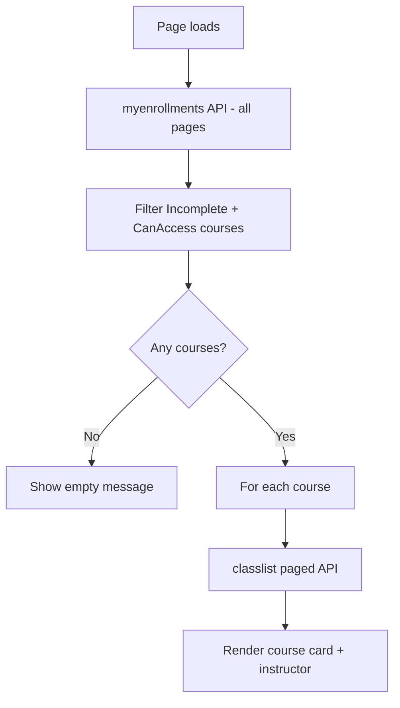

# Student Incomplete Courses Widget

A custom **Brightspace (D2L) homepage HTML widget** that shows students which of their courses they are enrolled in with an **Incomplete** role, with instructor names and a direct link to each course.

Originally built for **Delta College**. Intended for **student-facing** homepages. Runs entirely in the browser using Brightspace LP and LE APIs.

---

## What it does

1. Loads all enrollments for the logged-in student (paginated)
2. Filters to **Course Offering** enrollments where:
   - Role is Incomplete (`Student2`, name contains `incomplete`, or role ID `107`)
   - `CanAccess` is `true`
3. If none → shows a yellow info box: *"You do not have any incomplete courses at this time."*
4. If any → shows a card per course with:
   - Course name and code
   - Instructor name(s) from classlist
   - **Go to Course** button

---

## How it works



### Data sources

| API | Purpose |
|-----|---------|
| `GET /d2l/api/lp/.../enrollments/myenrollments/` | Student enrollments |
| `GET /d2l/api/le/.../{orgUnitId}/classlist/paged/` | Instructor names |

All requests use the browser session and `X-Csrf-Token` when available. API paths are **relative** (no hardcoded domain).

---

## Files in this folder

| File | Description |
|------|-------------|
| `student-incomplete-courses-widget.html` | Complete widget markup + inline CSS + JavaScript |
| `README.md` | This documentation |

---

## Requirements

- Student-facing homepage placement
- Student enrolled with Incomplete role in one or more accessible courses
- Incomplete role must match config (default: `Student2`, role ID `107`, or name containing `incomplete`)

---

## Installation

1. Confirm your Incomplete student role name and ID in **Admin Tools → Roles and Permissions**.
2. Open **Admin Tools → Homepage Management** on the **student homepage**.
3. Create or edit an **HTML / Custom Widget**.
4. Paste the full contents of `student-incomplete-courses-widget.html`.
5. Update role names/IDs in the config block if needed.
6. Save and test as a student with an incomplete enrollment.

---

## Adapting for other institutions

Search `student-incomplete-courses-widget.html` for the config block:

```javascript
var LP_VERSION = "1.51";
var LE_VERSION = "1.78";
var INCOMPLETE_ROLE_NAMES = ["student2", "incomplete student", "incomplete"];
var INCOMPLETE_ROLE_IDS = [107];
```

| Setting | What to change |
|---------|----------------|
| `INCOMPLETE_ROLE_NAMES` | Role display names for incomplete students at your org |
| `INCOMPLETE_ROLE_IDS` | Org role ID(s) for incomplete students |
| `LP_VERSION` / `LE_VERSION` | API versions your instance supports |

### Branding

- Card accent: `#0077cc` (left border and button)
- Empty state: yellow warning box (`#fff3cd`)

### Course link

Uses `OrgUnit.HomeUrl` when present, otherwise `/d2l/home/{orgUnitId}`.

---

## Customization checklist

- [ ] Confirm Incomplete student role name (`Student2` or equivalent)
- [ ] Confirm role ID if using numeric match (`107` at Delta)
- [ ] Place on student homepage only
- [ ] Test with student who has incomplete course(s)
- [ ] Test with student who has none (empty message)
- [ ] Verify instructor names load from classlist

---

## Troubleshooting

| Symptom | Likely cause |
|---------|----------------|
| Empty message but student has incomplete course | Wrong role name/ID; or `CanAccess` is false |
| `Error loading courses` | API permission or session issue — check console |
| Instructor shows `Unavailable` | Classlist permission denied or no instructor in classlist |
| Wrong courses listed | Role name matching too broad (`incomplete` substring) |

---

## Security and privacy notes

- Only shows courses for the **logged-in student**.
- No external servers or CSV files.
- Place on student homepage only.

---

## Related widgets

- **Faculty Incomplete Students** — instructor view of incomplete students across their courses

---

## License and contribution

Shared for use and adaptation by other Brightspace administrators.

---

## Credits

Developed by **Delta College** eLearning / D2L administration.

**Version notes:**

- Incomplete roles: `Student2`, ID `107`, name contains `incomplete`
- LP API: `1.51`, LE API: `1.78`
