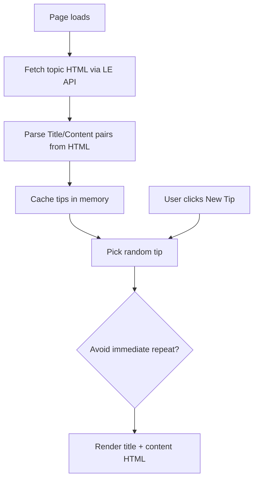

# Tech Tips Widget

A custom **Brightspace (D2L) homepage HTML widget** that displays a random **D2L tech tip** for faculty. Tips are authored as HTML in a single **Content topic** in your organization—and updated there whenever you want a new batch of tips live.

Originally built for **Delta College**. The widget runs entirely in the browser using Brightspace’s Learning Environment (LE) Content API—no separate server, CSV, or OAuth app required.

---

## What it does

- Loads on page view and shows a **random tip** from your tips topic
- **"Click to get a new D2L Tech Tip"** button loads another random tip
- Avoids showing the **same tip twice in a row** (uses `localStorage`)
- Caches parsed tips in memory for the session (only re-fetches the topic file on first load)

This widget is intended for **faculty-facing** homepages. Place it on a homepage or widget zone visible to instructors only (via Brightspace homepage role restrictions).

---

## How it works



### Data source

| Setting | Delta College value | Purpose |
|---------|---------------------|---------|
| `ORG_UNIT_ID` | `6605` | Organization (or org-level course shell) where the tips topic lives |
| `TOPIC_ID` | `4497966` | Content topic ID containing all tips |
| `LE_VERSION` | `1.82` | Brightspace LE API version |

API endpoint used:

```
GET /d2l/api/le/{LE_VERSION}/{ORG_UNIT_ID}/content/topics/{TOPIC_ID}/file
```

The widget fetches the topic’s HTML file using the user’s Brightspace session (`credentials: "include"`).

---

## Files in this folder

| File | Description |
|------|-------------|
| `tech-tips-widget.html` | Complete widget markup + inline CSS + JavaScript |
| `README.md` | This documentation |

---

## Content format (tips topic)

Create or edit a **Content topic** in Brightspace (HTML document). Each tip is a **Title** paragraph followed by a **Content** paragraph.

Use this exact label pattern (case-insensitive on the label):

```html
<p><strong>Title:</strong> Use the Class Progress tool</p>
<p><strong>Content:</strong> Open <em>Class Progress</em> from the navbar to see which students have not logged in recently. Filter by Last Accessed to prioritize outreach.</p>

<p><strong>Title:</strong> Pin important announcements</p>
<p><strong>Content:</strong> Pin your syllabus and welcome announcement so they stay at the top of the Announcements widget for the first two weeks.</p>
```

### Rules

| Rule | Detail |
|------|--------|
| **Title line** | `<p>` with `<strong>Title:</strong>` (or `Title` without colon) |
| **Content line** | Next `<p>` with `<strong>Content:</strong>` immediately after the title |
| **HTML in content** | Supported—links, `<em>`, lists, etc. render in the widget body |
| **Multiple tips** | Repeat Title/Content pairs in the same topic file |
| **Minimum** | At least one valid Title/Content pair or the widget shows an error |

Labels are detected by reading the `<strong>` text inside each `<p>`.

---

## Installation (Delta College)

1. Create or locate the **Tech Tips** content topic in org unit `6605`.
2. Note the topic’s numeric **Topic ID** (from the topic URL or API).
3. Paste tips using the Title/Content format above.
4. Open **Admin Tools → Homepage Management** (or your faculty homepage editor).
5. Create or edit an **HTML / Custom Widget** on a **faculty-only** homepage.
6. Paste the full contents of `tech-tips-widget.html`.
7. Confirm `ORG_UNIT_ID`, `TOPIC_ID`, and `LE_VERSION` match your environment.
8. Save and test as a faculty user.

---

## Adapting for other institutions

Search `tech-tips-widget.html` for these values at the top of the script:

### 1. Organization unit ID

```javascript
var ORG_UNIT_ID = 6605;
```

Replace with the org unit ID where your tips topic is stored. This is often your top-level organization ID or a dedicated “faculty resources” org unit.

**Find it:** Admin Tools → Org Unit Editor, or from the course/org URL in Brightspace.

### 2. Topic ID

```javascript
var TOPIC_ID = 4497966;
```

Replace with your tips topic’s numeric ID.

**Find it:** Open the topic in Content, then check the URL:

```
/d2l/le/content/6605/viewContent/4497966/View
                              ^^^^^^^^ topic ID
```

### 3. LE API version

```javascript
var LE_VERSION = "1.82";
```

Use a version your Brightspace instance supports. Check [Brightspace API versions](https://docs.valence.desire2learn.com) or test with your instance’s current LE API.

### 4. Button and styling

Update button text, fonts, and colors in the HTML at the top of the file. All styles are inline.

### 5. Faculty-only placement

This widget does not check user role in code—it relies on **homepage visibility** settings. Restrict the homepage or widget zone to faculty/instructor roles so students do not see it.

---

## Customization checklist

- [ ] Create tips topic with Title/Content pairs
- [ ] Set `ORG_UNIT_ID` to your org unit
- [ ] Set `TOPIC_ID` to your topic
- [ ] Verify `LE_VERSION` works on your instance
- [ ] Place widget on faculty-only homepage
- [ ] Test initial load and “new tip” button
- [ ] Test with 2+ tips (repeat avoidance)

---

## Updating tips

To publish new tips:

1. Edit the Content topic in Brightspace (no widget code change needed).
2. Add, remove, or revise Title/Content pairs.
3. Save the topic.

**Note:** Tips are cached in the browser for the session. Users who already loaded the page may need to refresh to see newly added tips. Clicking “new tip” only rotates within the cached list until the page is reloaded.

To force a fresh fetch on every click, remove or reset `tipsCache` in the `loadTip()` function (advanced).

---

## Troubleshooting

| Symptom | Likely cause |
|---------|----------------|
| `HTTP 403` or `404` | Wrong `ORG_UNIT_ID` or `TOPIC_ID`; user lacks permission to view the topic |
| `No tips found. Keep the Title/Content pairs.` | Topic HTML missing valid `<strong>Title:</strong>` / `<strong>Content:</strong>` structure |
| Same tip every time | Only one tip in the topic |
| Stale tips after editing topic | Session cache—refresh the homepage |
| `Couldn't load tip.` | API version mismatch or topic not published |

### Debug tips

1. Log in as a faculty user who can open the tips topic in Content.
2. Open browser DevTools → Network and confirm the `/content/topics/{id}/file` request succeeds.
3. View the topic HTML source and verify Title/Content paragraph structure.

---

## Security and privacy notes

- Tips are fetched with the **logged-in user’s** session—only users who can read the topic will see tips.
- Content HTML is injected into the widget with `innerHTML`—only trusted admins should edit the tips topic.
- Do not embed secrets in the tips topic or widget code.

---

## Related widgets

Other widgets in the [API-Widgets](https://github.com/Brightspace-Dashboard-Data-Community/API-Widgets) repository:

- **D2L Welcome Message** — personalized greeting and student engagement nudge
- **Upcoming Courses** — upcoming-term enrollments from SIS CSV

---

## License and contribution

Shared for use and adaptation by other Brightspace administrators. When forking:

- Replace `ORG_UNIT_ID` and `TOPIC_ID`
- Document your tips topic location and update process
- Test on a faculty-only homepage before production

---

## Credits

Developed by **Delta College** eLearning / D2L administration.

**Version notes:**

- Org unit: `6605`
- Topic ID: `4497966`
- LE API: `1.82`
- Content format: `Title:` / `Content:` paragraph pairs
