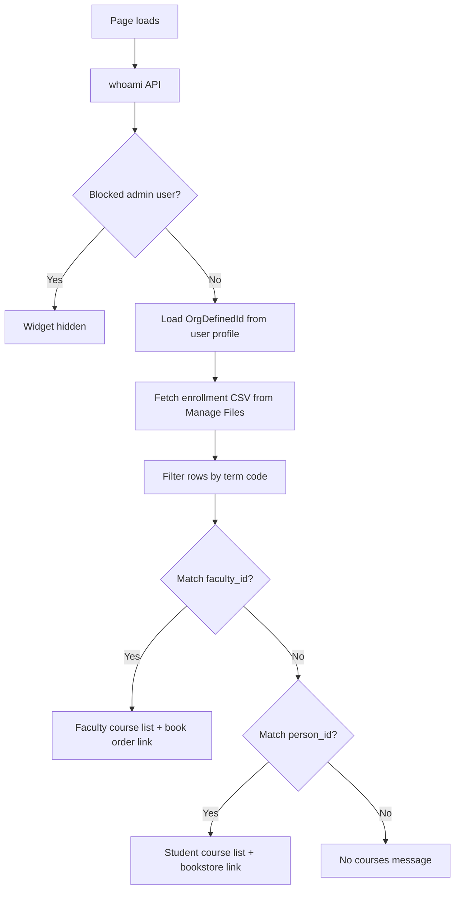

# Upcoming Courses Widget

A custom **Brightspace (D2L) homepage HTML widget** that shows a user their **upcoming-term course enrollments** pulled from an SIS enrollment CSV—before those courses appear on the standard My Courses list.

Originally built for **Delta College**. The widget runs entirely in the browser using Brightspace’s built-in APIs and a CSV file you host in **Manage Files**—no separate server or OAuth app required.

---

## What it does

| Audience | Behavior |
|----------|----------|
| **Instructors** | Lists sections they are assigned to teach for the configured term, with a link to submit textbook orders |
| **Students** | Lists courses they are enrolled in for the configured term, with instructor name and a bookstore link |

The widget looks up the logged-in user’s **Org Defined ID** and matches it against `faculty_id` (instructors) or `person_id` (students) in your enrollment export.

### Priority logic

1. If the user has **instructor** rows for the term → show the **faculty** view (no instructor names on course cards).
2. Otherwise → show the **student** view (includes instructor names).
3. If no matching rows → show *"No {Term} courses found."*

### Enrollment status handling

Only rows with status **`A`** (add/enrolled) or **`N`** (new) are treated as active enrollments.

If a student or faculty member has multiple rows for the same person + section + term (e.g. adds and drops over time), the widget keeps only the row with the **latest `stc_status_date`** before checking status. Dropped courses do not appear.

---

## How it works



### Data sources

| Source | Purpose |
|--------|---------|
| `GET /d2l/api/lp/.../users/whoami` | Current user identity |
| `GET /d2l/api/lp/.../users/{id}` | Org Defined ID (student/faculty ID from SIS) |
| **CSV in Manage Files** | Term enrollment export (same file used for Adds & Drops reporting) |

The widget uses the browser session (`credentials: "include"`) and `X-CSRF-Token` from `localStorage` for D2L API calls.

### ID matching

SIS exports may strip **leading zeros** from `person_id` or `faculty_id`. The widget tries padded and unpadded variants (7–10 digits) so `1234567` matches `001234567` in Brightspace.

---

## Files in this folder

| File | Description |
|------|-------------|
| `upcoming-courses-widget.html` | Complete widget markup + inline CSS + JavaScript. Copy into a D2L **Custom Widget** or homepage HTML widget. |
| `README.md` | This documentation |

---

## Requirements

- Brightspace with permission to add **homepage widgets**
- **Manage Files** access to upload an enrollment CSV
- A recurring **SIS or Ellucian Insights enrollment export** for the target term
- Users must have **Org Defined ID** populated in Brightspace

---

## Installation (Delta College)

1. Export or publish your term enrollment file (e.g. from Ellucian Insights / Adds & Drops pipeline).
2. Upload to Manage Files:
   ```
   /content/future-courses/26FA-Enrollments-Students.csv
   ```
3. Open **Admin Tools → Homepage Management** (or your org’s widget editor).
4. Create or edit an **HTML / Custom Widget**.
5. Paste the full contents of `upcoming-courses-widget.html`.
6. Save and add the widget to the desired homepage layout.
7. Test as both a student and instructor with known enrollments in the CSV.

---

## CSV format

The widget expects the **Ellucian Insights / Adds & Drops** column layout (lowercase headers after parsing):

| Column | Example | Notes |
|--------|---------|-------|
| `faculty_id` | `9876543` | Matched to instructor Org Defined ID |
| `person_id` | `1234567` | Matched to student Org Defined ID |
| `term` | `26/FA` | Filtered by term regex in widget |
| `status` | `A`, `N`, `D`, `X` | Only `A` and `N` count as enrolled |
| `stc_status_date` | `05/11/2026` | Used for deduplication (latest wins) |
| `sec_title` | `Introduction to Psychology` | Course title displayed |
| `sec_name` | `PSY-101-FA810` | Primary section code display |
| `course_name` | `PSY` | Fallback with `section` if `sec_name` missing |
| `section` | `FA810` | Fallback section number |
| `faculty_name` | `Smith, John` | Shown on student view only |

UTF-8 BOM at the start of the file is handled automatically.

---

## Adapting for other institutions

Search `upcoming-courses-widget.html` for the values below.

### 1. CSV URL

```javascript
const csvUrl = 'https://YOUR-BRIGHTSPACE-DOMAIN/content/YOUR-FOLDER/26FA-Enrollments-Students.csv';
```

Use a stable filename per term and update each semester.

### 2. Term filter

Current configuration is **Fall 2026** (`26/FA`):

```javascript
const FALL_26_TERMS = /26\/FA/i;

function isFall26Term(term) {
  return FALL_26_TERMS.test(String(term || '').trim());
}
```

**Spring/Summer example:**

```javascript
const SPRING_SUMMER_26_TERMS = /26\/(SP|SU|SM|SS)/i;
```

| Semester | Example regex |
|----------|----------------|
| Fall 2026 | `/26\/FA/i` |
| Spring/Summer 2026 | `/26\/(SP\|SU\|SM\|SS)/i` |
| Winter 2026 | `/26\/WI/i` |

Also update heading text (`Fall 26 Courses`, `Fall 26 Enrollments`, empty-state message).

### 3. College name and links

Update faculty and student footer links:

| Setting | Delta College example |
|---------|----------------------|
| Faculty book orders | `Textbook requisition` (internal D2L link) |
| Student bookstore | `https://www.bookstore.delta.edu/buy_textbooks.asp` |
| Book order deadline | April 10, 2026 |
| Bookstore availability | Starting August 2026 |

### 4. Blocked users (optional)

Admin test accounts can be hidden from the widget:

```javascript
const blockedUsers = ['admin.username', 'another.user'];
```

### 5. Branding

Course cards use a blue left border (`#0077cc`). Update inline styles in `renderCourseList` and container `innerHTML` strings to match your college colors.

---

## Customization checklist

Use this when rolling out to a new term or institution:

- [ ] Upload current-term enrollment CSV to Manage Files
- [ ] Update `csvUrl` in the widget
- [ ] Update term filter regex and all display labels
- [ ] Update bookstore and textbook requisition links
- [ ] Update book deadline / availability messaging
- [ ] Adjust `blockedUsers` if needed
- [ ] Test as instructor with `faculty_id` in CSV
- [ ] Test as student with `person_id` in CSV
- [ ] Test user with no rows (empty state)
- [ ] Test user with a recent drop (should not appear)

---

## Troubleshooting

| Symptom | Likely cause |
|---------|----------------|
| `Widget Error: CSV fetch failed: 404` | CSV missing or wrong path in Manage Files |
| `Unable to load your student or faculty ID` | `OrgDefinedId` empty on user profile |
| No courses for a known enrolled student | ID mismatch (leading zeros); wrong term filter; latest row is a drop status |
| Instructor sees student view | No `faculty_id` match in CSV for that term—instructor rows take priority when present |
| Widget blank for admins | Username listed in `blockedUsers` |
| Wrong courses showing | Wrong term CSV or term regex; stale CSV not refreshed |

### Debug tips

Open **Developer Tools → Console** while logged in as the test user. The widget logs errors to the console on failure. Verify:

1. CSV URL loads in browser while logged into Brightspace
2. User’s Org Defined ID matches a `person_id` or `faculty_id` in the file
3. Row `term` matches your regex (e.g. `26/FA`)
4. Latest `stc_status_date` row for that section has status `A` or `N`

---

## Security and privacy notes

- The widget only loads the **currently logged-in user’s** profile via Brightspace APIs.
- The CSV is fetched from your Brightspace **Manage Files** path (same-origin session).
- The enrollment CSV contains student and faculty data—restrict Manage Files permissions appropriately.
- Do not embed API keys or secrets in the widget HTML.

---

## Semester maintenance

At the start of each registration or pre-term period:

1. Generate a new enrollment CSV for the upcoming term.
2. Upload to Manage Files (update filename if needed).
3. Update `csvUrl`, term regex, and UI labels in the widget.
4. Update bookstore / textbook messaging dates.
5. Spot-check a few known students and instructors.

---

## Related widgets

Other widgets in the [API-Widgets](https://github.com/Brightspace-Dashboard-Data-Community/API-Widgets) repository:

- **D2L Welcome Message** — personalized homepage greeting and student course engagement nudge

---

## License and contribution

This widget is shared for use and adaptation by other Brightspace administrators. When forking or publishing:

- Replace institution-specific URLs, links, and branding
- Document your CSV source and refresh schedule
- Test in a sandbox org before production deployment

---

## Credits

Developed by **Delta College** eLearning / D2L administration.

**Version notes (Fall 2026):**

- Term filter: `26/FA`
- CSV: `26FA-Enrollments-Students.csv`
- Enrollment statuses: `A`, `N` (with latest `stc_status_date` deduplication)
- ID matching supports leading-zero variants
