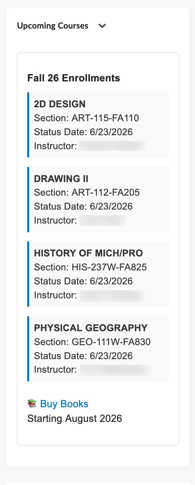
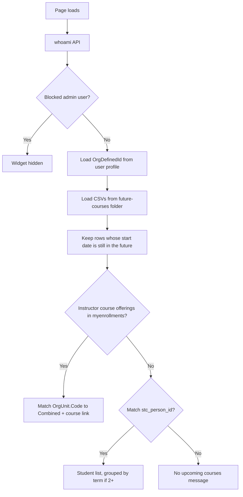

# Upcoming Courses Widget

A custom **Brightspace (D2L) homepage HTML widget** that shows a user their **upcoming course enrollments** from SIS CSV files in a Manage Files folder—before those courses start and appear on the standard My Courses list.

Originally built for **Delta College**. The widget runs entirely in the browser using Brightspace’s built-in APIs and CSV files you host in **Manage Files**—no separate server or OAuth app required.

---

## What it does

| Audience | Behavior |
|----------|----------|
| **Instructors** | Loads **My Enrollments**, matches each course offering **Code** to the CSV Combined field, lists upcoming sections (not yet started) with a link into the course |
| **Students** | Lists courses they are enrolled in (CSV `stc_person_id` ↔ Org Defined ID) that have not started yet, with instructor name and a bookstore link |

The widget looks up the logged-in user’s **Org Defined ID** and matches it against **`stc_person_id`** (students). Instructors are detected from Brightspace enrollments (role 102 / “Instructor”), not from `faculty_id` in the CSV.

### Multiple terms

Upload **one CSV per term** (leave them as separate files). The widget checks each name and skips any that are missing:

```
/content/future-courses/future_courses_26FA.csv
/content/future-courses/future_courses_27WI.csv
/content/future-courses/future_courses_27SP.csv
/content/future-courses/future_courses_27FA.csv
```

It also checks **later terms automatically** (`future_courses_28WI.csv`, `28SP`, `28FA`, …) for this year plus the next four years (FA, WI, SP, SU). Missing files 404 and are ignored. Files are never merged on disk.

Then it:

- Keeps only courses whose **`stc_start_date` is still in the future**
- If the user has courses in **more than one term**, groups them under semester headings (Fall 26, Winter 27, …)
- If only **one** future term is on screen, no extra semester headings—just that term’s title

### Priority logic

1. If **My Enrollments** includes instructor course offerings → match those offering codes to the CSV Combined field and show the **faculty** view (course title links to `/d2l/home/{OrgUnitId}`).
2. Otherwise → show the **student** view (includes instructor names).
3. If no matching **future** rows → show *"No upcoming courses found."*

Faculty teaching lists require the D2L course offering **Code** to match Combined values such as `OAT-151-FA860-26/FA`.

### Enrollment status handling

Only rows with status **`A`** (add/enrolled) or **`N`** (new) are treated as active enrollments.

If a student has multiple rows for the same person + combined section + term (e.g. adds and drops over time), the widget keeps only the row with the **latest `stc_current_status_date`** before checking status. Dropped courses do not appear.

---

## Screenshot



---

## How it works



### Data sources

| Source | Purpose |
|--------|---------|
| `GET /d2l/api/lp/.../users/whoami` | Current user identity |
| `GET /d2l/api/lp/.../users/{id}` | Org Defined ID (students) |
| `GET /d2l/api/lp/.../enrollments/myenrollments` | Instructor course offerings (Code + OrgUnitId) |
| **CSVs in Manage Files** | One Insights future-courses export per term in `/content/future-courses/` |

The widget uses the browser session (`credentials: "include"`) and `X-CSRF-Token` from `localStorage` for D2L API calls.

### ID matching

SIS exports may strip **leading zeros** from `stc_person_id`. The widget tries padded and unpadded variants (7–10 digits) so `1234567` matches `001234567` in Brightspace.

---

## Files in this folder

| File | Description |
|------|-------------|
| `upcoming-courses-widget.html` | Complete widget markup + inline CSS + JavaScript. Copy into a D2L **Custom Widget** or homepage HTML widget. |
| `sample-future_courses_26FA.csv` | Fake-data Fall 26 export in the `stc_*` layout |
| `sample-future_courses_27WI.csv` | Fake-data Winter 27 export (second file so you can test headings) |
| `README.md` | This documentation |

---

## Requirements

- Brightspace with permission to add **homepage widgets**
- **Manage Files** access to upload an enrollment CSV
- A recurring **SIS or Ellucian Insights enrollment export** for the target term
- Users must have **Org Defined ID** populated in Brightspace

---

## Installation (Delta College)

1. Export the Insights **future-courses** report for each upcoming term.
2. Upload each term as its **own** file (do not combine them):
   ```
   /content/future-courses/future_courses_26FA.csv
   /content/future-courses/future_courses_27WI.csv
   ```
3. Open **Admin Tools → Homepage Management** (or your org’s widget editor).
4. Create or edit an **HTML / Custom Widget**.
5. Paste the full contents of `upcoming-courses-widget.html`.
6. Save and add the widget to the desired homepage layout.
7. Test as both a student and instructor with known enrollments in the CSV.

---

## CSV format

The widget expects the Insights **future-courses** layout (headers are lowercased after parsing). Extra columns are ignored.

```
stc_course_name,stc_end_date,stc_person_id,stc_section_no,stc_start_date,stc_current_status,stc_current_status_date,stc_term,stc_title,"Combined stc_course_name, stc_section_no, stc_term",faculty_name
```

Use `sample-future_courses_26FA.csv` as a side-by-side template.

| Column | Example | Notes |
|--------|---------|-------|
| `stc_person_id` | `1000001` | Matched to student Org Defined ID (leading zeros OK) |
| `stc_term` | `26/FA` | Used for labels and multi-term section headings (`Fall 26`, `Winter 27`) |
| `stc_current_status` | `A`, `N`, `D`, `X`, `NP`, `C` | Only `A` and `N` count as enrolled |
| `stc_current_status_date` | `March 5, 2026, 12:00 AM` | Used for deduplication (latest wins) |
| `stc_start_date` | `August 31, 2026, 12:00 AM` | Shown as **Starts**. Course is hidden once this timestamp is in the past. |
| `stc_end_date` | `December 18, 2026, 12:00 AM` | Shown as **Ends** |
| `stc_title` | `COLLEGE COMP I` | Course title displayed |
| `Combined stc_course_name, stc_section_no, stc_term` | `ENG-111-FA802-26/FA` | Section line (D2L-style code). Built from the three parts if this column is missing. |
| `stc_course_name` | `ENG-111` | Used only if Combined is missing |
| `stc_section_no` | `FA802` | Used only if Combined is missing |
| `faculty_name` | `Smith, Jane A` | Shown on student view. Insights may export a long model header that **ends with** `faculty_name` — that still matches. |

UTF-8 BOM at the start of the file is handled automatically. Combined and faculty headers that contain commas must be quoted in the CSV.

---

## Adapting for other institutions

Search `upcoming-courses-widget.html` for the values below.

### 1. CSV folder

```javascript
const CSV_FOLDER = '/content/future-courses/';
```

The widget **checks** these names in the folder (404 = skip, file stays separate):

```
future_courses_26FA.csv
future_courses_26WI.csv
future_courses_26SP.csv
future_courses_26SU.csv
future_courses_27FA.csv
future_courses_27WI.csv
future_courses_27SP.csv
future_courses_27SU.csv
…through the next four years
```

No widget HTML edit is required when you add `future_courses_28FA.csv` later.

### 2. Future-only filter and term headings

There is no hardcoded term regex. A row is shown only when `stc_start_date` is **after now**. Semester section headings (`Fall 26`, `Winter 27`) render only when the user has **two or more** future terms on screen.

Term labels come from `stc_term` (`26/FA` → Fall 26, `27/WI` → Winter 27).

### 3. College name and links

Update faculty and student footer links:

| Setting | Delta College example |
|---------|----------------------|
| Faculty book orders | `Textbook requisition` (internal D2L link) |
| Student bookstore | `https://bookstore.yourcollege.edu/buy_textbooks.asp` |
| Bookstore availability | August 10th, 2026 |

### 4. Blocked users (optional)

Admin test accounts can be hidden from the widget:

```javascript
const blockedUsers = ['admin.username', 'another.user'];
```

### 5. Branding

Course cards use a blue left border (`#0077cc`). Update inline styles in `renderCourseList` and container `innerHTML` strings to match your college colors.

---

## Customization checklist

Use this when rolling out to a new term or institution:

- [ ] Upload each upcoming-term CSV as `future_courses_{yy}{TERM}.csv` (separate files)
- [ ] Confirm `CSV_FOLDER` in the widget
- [ ] Update bookstore and textbook requisition links
- [ ] Adjust `blockedUsers` if needed
- [ ] Test as student with `stc_person_id` matching Org Defined ID
- [ ] Test as instructor: offering Code matches Combined and title links to the course
- [ ] Confirm Combined section code and start/end dates display
- [ ] Confirm a course disappears after its start date
- [ ] With two term files loaded, confirm semester headings appear
- [ ] With only one future term, confirm no extra semester headings
- [ ] Test user with no rows (empty state)
- [ ] Test user with a recent drop (should not appear)

---

## Troubleshooting

| Symptom | Likely cause |
|---------|----------------|
| Students see *No upcoming courses found.* | Empty match, start date already passed, missing CSV, or empty Org Defined ID. Open **Console** for the technical reason. |
| No courses for a known enrolled student | ID mismatch; start date already passed; latest row is a drop status |
| A started class still listed | `stc_start_date` missing or unparseable (must be a real future timestamp) |
| Two term files but no semester headings | The user’s remaining **future** courses are all in one term (the other term already started or has no match) |
| Instructor sees student view / no teaching list | No instructor course offerings in My Enrollments, or offering **Code** does not match CSV Combined (e.g. `OAT-151-FA860-26/FA`) |
| Widget blank for admins | Username listed in `blockedUsers` |
| Wrong courses showing | Stale CSV in Manage Files; browser cache (widget fetches with `cache: no-store`) |

### Debug tips

Open **Developer Tools → Console** while logged in as the test user. The widget logs errors to the console on failure. Verify:

1. CSV files in `/content/future-courses/` load while logged into Brightspace (`future_courses_26FA.csv`, `future_courses_27WI.csv`, …)
2. User’s Org Defined ID matches a `stc_person_id` in the file
3. Latest `stc_current_status_date` row for that section has status `A` or `N`
4. `stc_start_date` is in the future
5. Combined column (or course + section + term) is populated

---

## Security and privacy notes

- The widget only loads the **currently logged-in user’s** profile via Brightspace APIs.
- The CSV is fetched from your Brightspace **Manage Files** path (same-origin session).
- The enrollment CSV contains student and faculty data—restrict Manage Files permissions appropriately.
- Do not embed API keys or secrets in the widget HTML.

---

## Semester maintenance

At the start of each registration or pre-term period:

1. Generate a new enrollment CSV for the upcoming term.
2. Upload it beside the current file as `future_courses_{yy}{TERM}.csv`. Do not combine term files. No widget HTML edit is required for a new term.
3. Remove or leave the previous term file; started courses drop off automatically via `stc_start_date`.
4. Spot-check a few known students.

---

## Related widgets

Other widgets in the [API-Widgets](https://github.com/Brightspace-Dashboard-Data-Community/API-Widgets) repository:

- **D2L Welcome Message** — personalized homepage greeting and student course engagement nudge

---

## License and contribution

This widget is shared for use and adaptation by other Brightspace administrators. When forking or publishing:

- Replace institution-specific URLs, links, and branding
- Document your CSV source and refresh schedule
- Test in a sandbox org before production deployment

---

## Credits

Developed by **Delta College** eLearning / D2L administration.

**Version notes (Fall 2026):**

- Folder: `/content/future-courses/` with separate `future_courses_{yy}{TERM}.csv` files (checked individually; missing files skipped)
- Student match: Org Defined ID → `stc_person_id`
- Faculty match: My Enrollments offering Code → CSV Combined, title links to `/d2l/home/{OrgUnitId}`
- Display: Combined section code, start/end dates, instructor name
- Only courses whose `stc_start_date` is still in the future
- Semester headings only when two or more future terms are on screen
- Enrollment statuses: `A`, `N` (with latest `stc_current_status_date` deduplication)
- ID matching supports leading-zero variants
