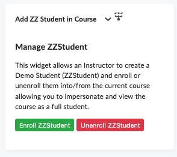
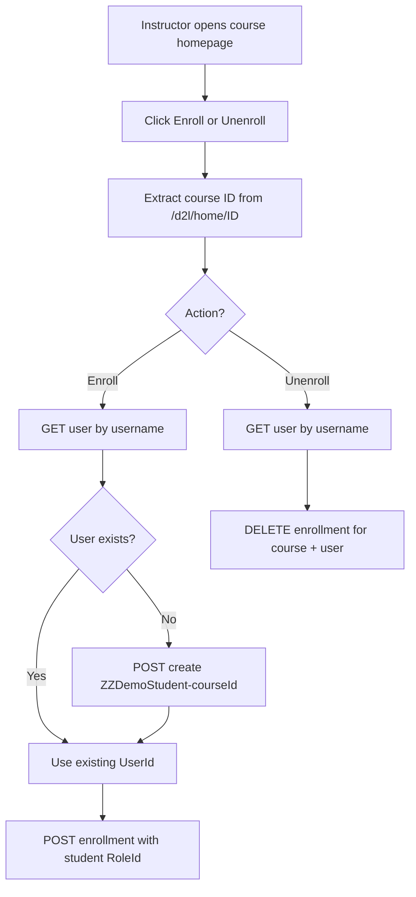

# ZZStudent Demo Widget

A custom **Brightspace (D2L) course homepage HTML widget** that lets an instructor **enroll or unenroll a demo student (ZZStudent)** in the current course, so they can impersonate and preview the course as a full student.

Originally built for **Delta College**. Intended for **faculty course homepages** (not the org-level homepage). Runs entirely in the browser using Brightspace LP APIs.

---

## What it does

1. Reads the **current course Org Unit ID** from the parent course homepage URL (`/d2l/home/{orgUnitId}`)
2. **Enroll ZZStudent**
   - Looks up `ZZDemoStudent-{courseId}`
   - Creates the user if missing (FirstName `ZZDemo`, LastName `ZZStudent`)
   - Enrolls them in the current course with the configured student role
3. **Unenroll ZZStudent**
   - Finds the same username and removes their enrollment from the current course

Status messages appear below the buttons after each action.

---

## Screenshot



---

## How it works



### Data sources

| API | Purpose |
|-----|---------|
| `GET /d2l/api/lp/.../users/?userName=` | Find existing demo student |
| `POST /d2l/api/lp/.../users/` | Create demo student if missing |
| `POST /d2l/api/lp/.../enrollments/` | Enroll demo student in course |
| `DELETE /d2l/api/lp/.../enrollments/orgUnits/{id}/users/{userId}` | Unenroll demo student |

All requests use the browser session and `X-Csrf-Token`. The hostname is taken from `window.location.hostname` (no hardcoded domain).

### Demo student naming

| Field | Value |
|-------|--------|
| Username | `ZZDemoStudent-{courseId}` |
| First / Last | `ZZDemo` / `ZZStudent` |
| Email | `{username}@yourcollege.edu` (configurable) |
| Role ID | `112` (configurable student / demo role) |

One demo user is created **per course ID**, so enrollments stay isolated by course.

---

## Files in this folder

| File | Description |
|------|-------------|
| `zzstudent-demo-widget.html` | Complete widget markup + inline CSS + JavaScript |
| `ZZStudent-Demo.jpg` | Screenshot of the widget |
| `README.md` | This documentation |

---

## Requirements

- Place on a **course homepage** (widget must be able to read `/d2l/home/{orgUnitId}` from the parent frame)
- Logged-in user must have permission to **create users** and **manage enrollments** (or your institution’s equivalent for demo accounts)
- A student / demo role matching `STUDENT_ROLE_ID` (default `112`)

---

## Installation

1. Confirm your demo/student role ID in **Admin Tools → Roles and Permissions**.
2. Open **Admin Tools → Homepage Management** for the **course** homepage (or a faculty course template).
3. Create or edit an **HTML / Custom Widget**.
4. Paste the full contents of `zzstudent-demo-widget.html`.
5. Update `STUDENT_ROLE_ID` and `EMAIL_DOMAIN` if needed.
6. Save and test as an instructor on a course homepage.

---

## Adapting for other institutions

Search `zzstudent-demo-widget.html` for the config block:

```javascript
var LP_VERSION = "1.45";
var STUDENT_ROLE_ID = 112;
var EMAIL_DOMAIN = "yourcollege.edu";
```

| Setting | What to change |
|---------|----------------|
| `STUDENT_ROLE_ID` | Org role ID used for demo students |
| `EMAIL_DOMAIN` | Email domain for generated demo accounts |
| `LP_VERSION` | LP API version supported by your Brightspace instance |

### Branding

- Enroll button: green `#28a745`
- Unenroll button: red `#dc3545`

---

## Customization checklist

- [ ] Confirm demo/student role ID (`112` or your equivalent)
- [ ] Set `EMAIL_DOMAIN` to your institution
- [ ] Place on course homepage only (not org homepage)
- [ ] Test enroll when demo user does not yet exist
- [ ] Test enroll when demo user already exists
- [ ] Test unenroll
- [ ] Confirm instructors can impersonate the demo student after enroll

---

## Troubleshooting

| Symptom | Likely cause |
|---------|----------------|
| `Failed to extract course ID` | Widget not on a course homepage, or iframe parent path does not include `/home/{id}` |
| `Failed to create demo student` | Missing user-create permission, or role ID invalid |
| `Failed to enroll demo student` | Missing enrollment permission, or user already enrolled (check console) |
| `Failed to find demo student` | Demo user was never created for this course ID |
| `Failed to unenroll demo student` | Enrollment already removed, or DELETE permission denied |

### Debug

Open **Developer Tools → Console** for API status codes. Usernames always follow `ZZDemoStudent-{courseId}` for the course you are viewing.

---

## Security and privacy notes

- Creates real Brightspace users with a predictable username pattern.
- Restrict the widget to **faculty course homepages**.
- Demo accounts should use a dedicated role with limited org privileges where possible.
- No data is sent to external servers.

---

## Related widgets

- **Faculty Navigation Menu** — includes a link to a separate ZZStudent web app and sandbox course creation that also provisions a ZZStudent

---

## License and contribution

Shared for use and adaptation by other Brightspace administrators. When forking:

- Verify the student/demo role ID for your org
- Replace `EMAIL_DOMAIN` before production use

---

## Credits

Developed by **Delta College** eLearning / D2L administration.

**Version notes:**

- Student / demo role ID: `112`
- LP API: `1.45`
